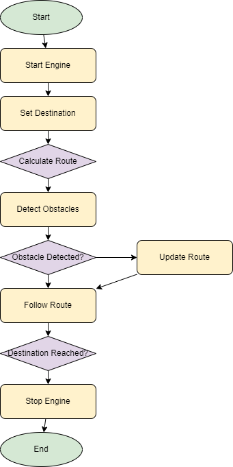

# Self-Driving Car Simulation 🚗

This project includes a basic **autonomous vehicle** simulation. The vehicle starts its engine, sets a destination, calculates the route, detects obstacles, and moves forward until it reaches the destination. If obstacles are detected, the route is updated, ensuring safe progress.

## 📂 Project Structure

```
self-driving-car/
│── src/
│   ├── models/
│   │   ├── Enums.ts
│   │   ├── Vehicle.ts
│   │   ├── Car.ts
│   │   ├── Sensor.ts
│   │   ├── Obstacle.ts
│   ├── interfaces/
│   │   ├── IEngine.ts
│   │   ├── INavigator.ts
│   ├── services/
│   │   ├── Engine.ts
│   │   ├── Navigator.ts
│   ├── main.ts
│── tsconfig.json
│── package.json
```

## 📜 Main Files and Descriptions

### **1️⃣ models/** (Models)

- `Enums.ts`: Defines **vehicle status (CarStatus)** and **direction information (Direction)** enums.
- `Vehicle.ts`: **Base vehicle class.** Includes acceleration, braking, and direction change functionalities.
- `Car.ts`: **Car class, derived from the Vehicle class.**
- `Sensor.ts`: **Sensor class, detects obstacles.**
- `Obstacle.ts`: **Obstacle class, represents obstacles on the road.**

### **2️⃣ interfaces/** (Interfaces)

- `IEngine.ts`: **Defines the interface for starting and stopping the engine.**
- `INavigator.ts`: **Navigation interface for route determination, calculation, and tracking.**

### **3️⃣ services/** (Services)

- `Engine.ts`: **Manages engine start and stop operations.**
- `Navigator.ts`: **Calculates routes and provides guidance to the destination.**

### **4️⃣ main.ts** (Main Application File)

- **Initializes the vehicle, engine, sensors, and navigation.**
- **Sets the destination and calculates the route.**
- **Detects obstacles and updates the route if necessary.**
- **Follows the route and stops the engine upon reaching the destination.**

## 🔄 Flowchart

Below is the flowchart illustrating the application workflow:



### 📌 Flow Description:

1. **Start** 🚦
2. **Engine starts** 🔑
3. **Destination is set** 📍
4. **Route is calculated** 🗺️
5. **Obstacles are detected** ⚠️
6. **If an obstacle is detected, the route is updated** 🔄
7. **The calculated route is followed** 🚗
8. **Upon reaching the destination, the engine stops** 🏁
9. **End** ✅

## 🚀 Running Instructions

**To install project dependencies:**

```sh
npm install typescript @types/node --save-dev
```

**To run the application:**

```sh
ts-node ./main.ts
```

## 📌 Notes

- **Sensors randomly detect obstacles,** so different results may occur on each run.
- **The ability to update the route and avoid obstacles is simulated.**

This project is created to understand the basics of **autonomous driving logic**. 🚗💨
